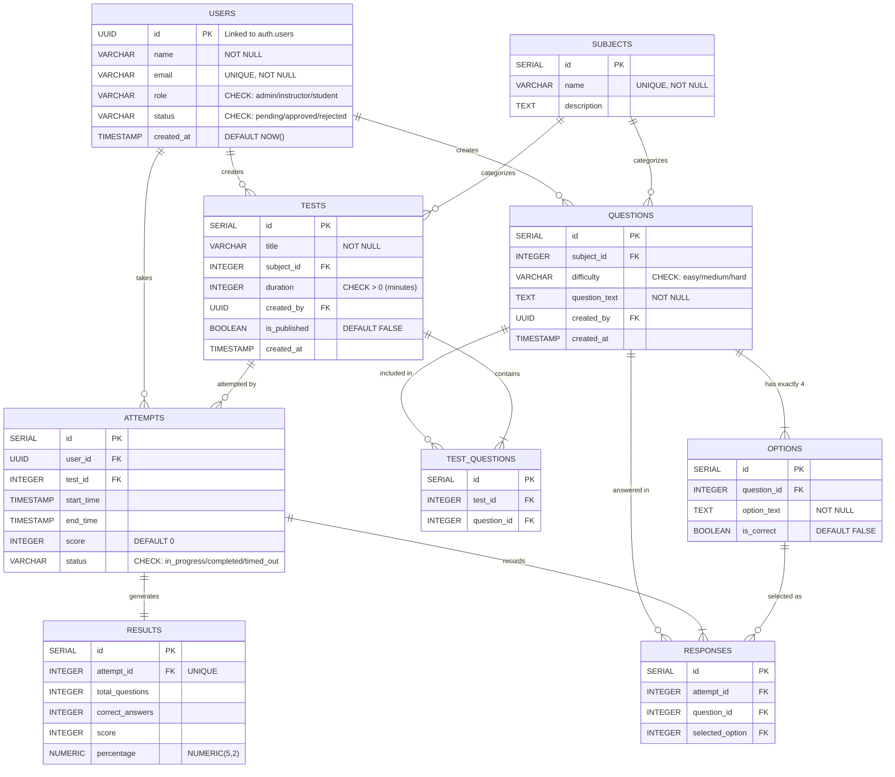

# ER Diagram — Online Assessment & Evaluation Platform

This document presents the Entity-Relationship diagram for the platform using Mermaid notation.

## ER Diagram

## Relationship Summary

| Relationship | Type | Description |
|-------------|------|-------------|
| User → Questions | 1:N | An instructor creates many questions |
| User → Tests | 1:N | An instructor creates many tests |
| User → Attempts | 1:N | A student makes many attempts |
| Subject → Questions | 1:N | A subject has many questions |
| Subject → Tests | 1:N | A subject has many tests |
| Question → Options | 1:4 | Each question has exactly 4 options |
| Test → Test_Questions | 1:N | A test contains many questions (junction) |
| Question → Test_Questions | 1:N | A question can be in many tests (junction) |
| Test → Attempts | 1:N | A test has many attempts |
| Attempt → Responses | 1:N | An attempt has many responses |
| Attempt → Result | 1:1 | Each attempt generates exactly one result |
| Option → Responses | 1:N | An option can be selected in many responses |

## Cardinality Notes

- **Tests ↔ Questions**: Many-to-Many relationship resolved through the `test_questions` junction table
- **Users → Attempts**: One-to-Many; students can attempt multiple tests
- **Attempts → Results**: One-to-One; each completed attempt has exactly one result record
- **Questions → Options**: One-to-Four; each question must have exactly 4 options with one correct answer
